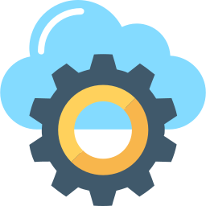

<!--
**atoosanasiri-seneca/atoosanasiri-seneca** is a ✨ _special_ ✨ repository because its `README.md` appears on your GitHub profile.
--->  

<h2 align="center"> 👋 Hi, there </h2>
  
I am an enthusiast Cloud Architect. Day job: deploying MLOps pipeline - GCP-K8S After hours: teaching AWS/Azure DevOps - Seneca Polytechnic 
  

  <!-- display the social media buttons in your README -->
  

    &nbsp;&nbsp;&nbsp;&nbsp;
    &nbsp;&nbsp;&nbsp;
    &nbsp;&nbsp;&nbsp;&nbsp;
  

  

    
       
    
  

<!-- To Link your profile to the media buttons -->  

<h2 align="center"> 🔭 Data Science Tools </h2>

  &nbsp;&nbsp;&nbsp;
  &nbsp;&nbsp;&nbsp;
  &nbsp;&nbsp;&nbsp;
  &nbsp;&nbsp;&nbsp;
  &nbsp;&nbsp;&nbsp;
  &nbsp;&nbsp;
  &nbsp;&nbsp;  

<h2 align="center"> ☁️ Cloud Stack </h2>

  &nbsp;&nbsp;&nbsp;
  &nbsp;&nbsp;&nbsp;
  &nbsp;&nbsp;&nbsp;
  &nbsp;&nbsp;&nbsp;

<h2 align="center"> ⚙️ DevOps Tools </h2>

  &nbsp;&nbsp;&nbsp;
  &nbsp;&nbsp;&nbsp;
  &nbsp;&nbsp;&nbsp;
  &nbsp;&nbsp;&nbsp;
  &nbsp;&nbsp;&nbsp;
  &nbsp;&nbsp;&nbsp;

<h2  align="center">💻 Check Out My Repos ⬇️ </h2>
